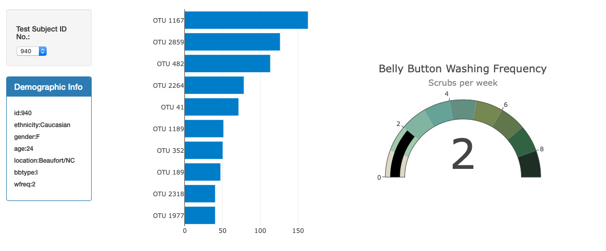
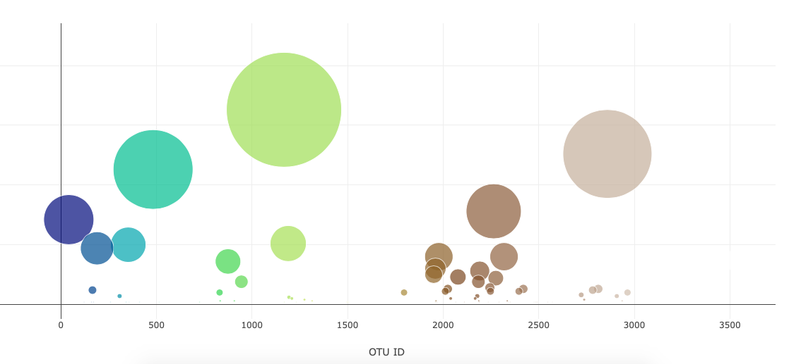

# Interactive-Dashboard

A dashboard was built to explore the Belly Button Biodiversity dataset, which catalogs the microbes that colonize human navels. 

## Data

As said before, the Belly Button Biodiversity dataset (http://robdunnlab.com/projects/belly-button-biodiversity/) was used. This dataset reveals that a small handful of microbial species (also called operational taxonomic units, or OTUs, in the study) were present in more than 70% of people, while the rest were relatively rare.

## Features

* Addtition of interactivity using Javascript 
* Use of different charts (gauge, bubble and bar plots)
* Deployment of the app

## Built with 

* D3.js
* Plotly.js

## Outcomes

### Website
https://velazquez-96.github.io/Interactive-Dashboard/
